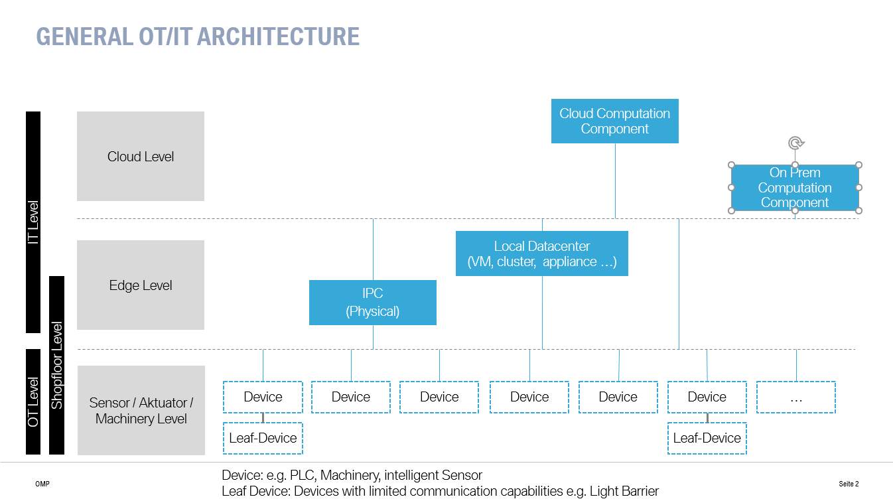

# 2.1. Fundamentals

## Goal of this chapter

Get a general understanding about manufacturing devices and corresponding terms.

---
 

## Device Basics
 

### Device Types

In general we distinguish between devices and Edge nodes. We often precises the term "devices" with the term "OT" (Operations Technology) to make it clearer we talk about a device from the shopfloor. 

> Definition of an OT Device.

Examples of OT devices are robots, plcs, conveyors, and sensors.

*Note*: an "IoT device" an an device which is enabled to communicate via the internet. Since this term is quite broad (mobile phone can also be IoT devices), we stick with the wording "OT Device" to put emphasis on the manufacturing aspects. For the ability to communicate with IoT Cloud architectures we define several compatbility classes in Chapter xxx.

An *Edge device* is *generic computational asset* suitable to run any kind of workloads. In easier words: It is a generic IPC or a virtual machine in a datacenter. Therefore we call it more generic "Edge node" (since it can also be in a data center).

 

### Device communication 

In general there exist two types of communication with OT devices: unidirectional an bidirectional.

#### Case A: unidirectional
+ A - Only uni directional communication from the device to an endpoint
 + e.g. simple sensor devices with the only purpose to inform endpoint(s) about gathered values)
 + use case example: temperature indicator

#### Case B: bidirectional

+ B - bi directional communication (can include feedback loops)
 + e.g. firmware updates, change of schedules
 + e.g. regulative devices

![Device Communication Basics][device_overview]

[device_overview]: images/OMP-IOT_device_characteristics_small.png 

<!-- mmuth: commented out this section but not deleted as it was discussed that this table might not be applicable here

## IOT connectivity acceptance criteria
Acceptance criteria for a device - measurable data points a device can rely on, when connectiong to the IoT backend systems (Reference here to the Reference Architecture(?)[2])

|value name| value description|Family A|Family B|Family C|
|----------|----------|----------|----------|----------|
|delay|acceptable delay measured in [time]|n.a.|yes|yes|
|data_processing | on board data processing on the device|n.a.|yes|yes|
|decision_making| on board decision making process|n.a.|yes|yes|yes|
|... tbc||||

-->

#### Standard Protocols

At the OT level there exist a lot of different protocols. Specialized realtime protocols (like Profinet, Powerlink...) are often not compatible with the upper IT systems, since the first group often has different ISO / OSI Layers then the standard *Ethernet* protocol, commonly used by IT Systems. For the connection between OT- and IT Levels two standards have developed a wide adoption in the last years:
*OPC UA* and *MQTT*.

Both protocols are seen as a common factory standard since they are vendor and hardware independent. Also there exist open source implementations for a variety of plattforms. Most OT device manufacturers have included at least one of these two protocols in their state of the art products.

Due to high adaptation costs in already built up production facilities, there are also many legacy protocol standards, which have often been in use for more than 20 years (e.g. Siemens S7 protocol). For these brownfields connectivity solutions will also be developed in this working group. 

 

### Device Capabilities
In order to enable a IoT device for a use case, a communication between the device and the application is necessary. Different devices have different capabilities, that's why it's necessary to have a close look, if the device and it's capabilities fit to the use case. For connectivity topics three different device capabilities are important: provided interfaces, flexibility of the data model and performance requirements.

The device could either transmit the data wired (e.g. Ethernet) or wireless (e.g. WLAN, 5G, UWB) which is for example necessary if a device is moving around. As different protocols have different characteristics, the supported protocols are also an important capability for device connectivity. Provided interfaces could be open standards, like OPC UA or MQTT, or device specific proprietary protocol. Often multiple protocols are supported and can be used in parallel. In order for the device to meet all requirements for a particular use case, it is important to consider whether only one-way communication or two-way communication is possible. 

The information should be provided self-descriptively and across all devices in the same semantic, so that the application side has as little adaptation and transformation effort as possible. Therefore, it is necessary to consider whether information can be modeled on the device. For example could it be possible to define the information model of a OPC UA Server running on the device or the message model of a MQTT message. 

As described in the chapter above, different amount of data must be exchanged between the device and the communication partner for different use cases. Therefore, another capability is the amount of data, that can be extracted, received, and processed without causing performance problems on the device.

---
 

## Edge Basics

 

Edge computing assumes extending our cloud capabilities geographically closer to shopfloor devices and moving some of the workloads closer to the data sources.
While doing that we want to keep cloud-native development practices and use the same tools that our available to us in the cloud environments.

### Advantages and Benefits of an Edge Architecture

By deploying workloads closer to data sources we can bring the following benefits to IIoT architectures:

* Security and data sovereignty - By processing data locally we don't send all the data over the public Internet. In this way we increase overall security and are able to comply with data sovereignty laws.
* Latency - Local data processing increases response time and helps with reducing the latency for the uses cases where that is important.
* Network bandwidth - For some use cases, like processing video feeds, it's impractical (or even impossible) to send all data to the cloud for processing.
* Buffering - Data can be locally buffered for easier use by Edge workloads.
* Additional hardware components (e.g. camera installation) needed

### Characteristics of an Edge Node

Edge Nodes have several distinc characteristics:
* You can install and run generic logic code on them (e.g. in different programming languages)
* They are capable of running ([Moby](https://mobyproject.org/)) containers.
* They have an uplink to the cloud
* They are managed remotely (via the cloud)
* They can run disconnected from the cloud for longer periods of time.

"Classic" IPCs in the shopfloor normally don't have a cloud connection and are managed by manually (keyboard, monitor), so they don't count as *Edge nodes*.

### Edge Hosting Possibilities

In terms of physical infrastructure used to host Edge nodes and workloads, there a few possible scenarios:

* Physical IPC (Edge Device) - A physical machine installed on the Edge. It can be managed autonomously or considered a remote node managed by the cloud.
* VM / Server in local data center - It's similar in characteristics to the Edge device, it's just a physical machine in the local/edge data center or a VM running on it.
* Cluster (Kubernetes) in local data center - It's possible to install whole clusters in Edge locations. They are usually smaller clusters with no auto-scaling options. The cluster is usually installed on three or more physical Edge devices or VMs.

 

# Sources

[1] https://en.wikipedia.org/wiki/Internet_of_things

[2] https://github.com/OpenManufacturingPlatform/manufacturing-reference-architecture

## Device Lifecycle

The previous chapter identified that different types of communication (Link to 2.1.2) may require edge devices (Link to 2.1.1) to perform a successful IT system and cloud integration. This chapter uses the Device Life Cycle to examine which steps are necessary for connecting, operating, but also retiring OT and edge devices. There are five steps that are descibed in detail: plan, provision, configure, operate & monitor and retire. In addition, the reader is pointed out which additional IT systems are necessary in order to be able to implement a connectivity solution holistically over all life cycle steps. 

&nbsp;

&nbsp;

**Plan**

Before the actual implementation of an connectivity solution can be done, a sufficient planning is necessary. The goal is evaluate the feasibility on the basis of personnel and financial effort. Therfor the requirements for hardware and software must be checked and an implementation plan should be examined. In order to be able to make a statement about the feasibility and financial viability of a connectivity solution, the following points must be considered:

* Definition of the **use case** supported by the connection solution: The use case is the basis for a definition of the requirements for needed devices and software solutions.
* Analysis of the **available devices**: It is necessary to evaluate whether the capabilities of the existing devices are sufficient for the desired use case or whether new devices are required.
* Definition of the **integration service**: Each device must be integrated into the global technical infrastructure to make its functionality available throughout the use case.
* Identification of **additional necessary components**: In order to close the bridge between devices and the integration service, additional hardware and software components may be required (e.g. applications on edge devices). 
* Considerations on **data models**: The connection of device and integration service is not only to be realized on a technical level, but also a consideration of the available data models is necessary. 

> *Integration Service* - Global technical infrastructure to make the device data available for different use cases and to enable IT systems to communicate with the device.

**Provision**

Once it has been defined which hardware and software components are necessary for a successful plant connection, the provisioning of the devices can be started. After this step both the OT and edge devices are ready to configure a connection between the device and the integration system. 

* **Basic setup** of the device: The installation of OS and additional software. Edge devices also require the installation of the Edge Runtime. 
* Both OT and edge devices must be transferred to the **device management service**. Automating the entry into the Device Management System is desirable, although not always possible. 
* Due to the edge runtime edge device have the possiblity to directly connect to the **device provisioning service**. 
Due to the automatic uplink to the Device Mangement System due to the Edge Runtime, edge devices have the possibility to reload additional configurations or software packages on their own.  

> *Device Management Service* - to be described

> *Device Provisioning Service* - to be described

**Configure**

While the previous steps are a preparation of the solution, in this step the communication between device and integration system is established. Various steps are required to implement this.

* Preparation of the data model: Specification how the message (e.g. MQTT message) or the information model (e.g. OPC UA Server) should be formatted.

* Selection of the data points to communicate with.

Example OPC UA:
* Since OPC UA servers are self-describing, the provided informations (information model) can be extracted via the browsing function. 
* With help of this informations the user can subscribe to specific data point and gets notified on change
* Additionaly communication partner can actively read or write data, and can call methods. 

**Operate & Monitor**

In order to be able to guarantee the greatest possible operational stability, holistic device and system monitoring is necessary. In case of failure it is necessary to be able to carry out an analysis with the help of the Monitoring Service. In addition, it must be possible to exchange hardware and software and to update software with the help of the Provisioning Service. 

> *Monitoring Service* - to be described

**Retire**

The final stage is retirement, which is typically initiated by the end of the device service life, a device failure or an upgrade cycle. In this stage the device informations must be removed from the device management service and firewall rules must be deactivated.

This chapter shows that in addition to the OT unit itself, further components and systems are necessary to implement a holistic, durable and satisfactory solution over all cycles. 
* Edge Devices to install Edge Applications
* Edge Applications with gateway functionality
* Integration Service
* Device Management Service
* Device Provisioning Service
* Monitoring Service

# Generic Use Cases

 **Process Control**

 Process control systems influence production equipment directly. Therefore a part of the connector is embedded into the PLC program to enable event-based communication. Guaranteed delivery and short response times are required to ensure a high performance communication (bidirectional), else synchronous communication will not be possible.

 **Data acquisition**

 Unidirectional data acquisition is based on simple technologies (e.g. fire & forget), which enables low frequent acquisition of production data (e.g. quality data,  traceability). Trigger can be both event and time-driven, while transmission time isn´t specified. Condition reporting should be seen as a special form of data acquisition.

 **Condition Monitoring**

 Condition Monitoring rely on specialized measurement techniques (e.g. vibration sensors), which allow high frequency data collection. However, connectivity will not be enabled by classical connectors due to stream data processing. High data volume as well as real time processing may require additional infrastructure.

 **Detailed criteria**

 |                 | **Process Control**                     | **Data Acquisition**           | **Condition Monitoring**        |
 |-----------------|-----------------------------------------|--------------------------------|---------------------------------|
 | Frequency       | medium-high (e.g. 1 > 100Hz)            | low-medium (e.g. ~ 0,2-1Hz)    | high (e.g. > 100Hz)             |
 | Delivery        | guaranteed                              | fire \& forget or guaranteed   | guaranteed                      |
 | Responsive Time | short                                   | short to medium to long        | short                           |
 | Trigger         | event-driven                            | event- or time-driven          | event- or time-driven           |
 | Data Volume     | low/medium                              | low/medium                     | low                             |
 | Communication   | bidirectional/synchronous               | unidirectional/asynchronous    | unidirectional/asynchronous     |
